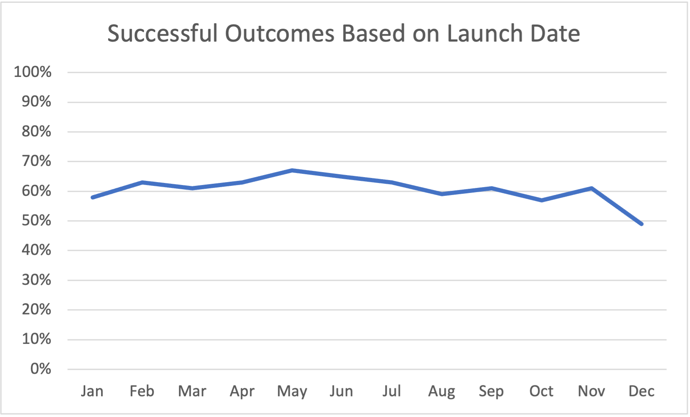
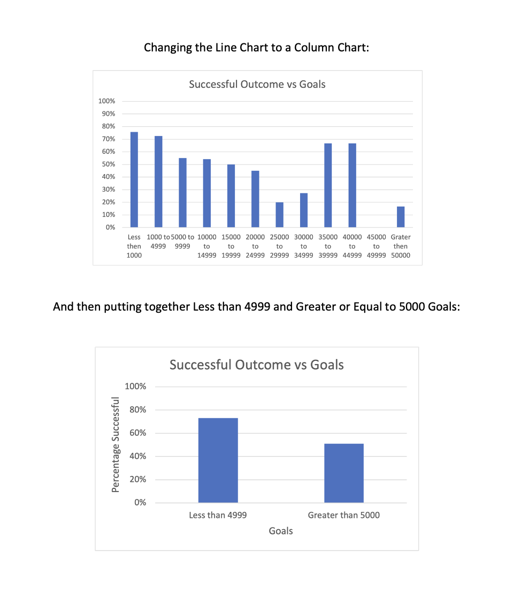
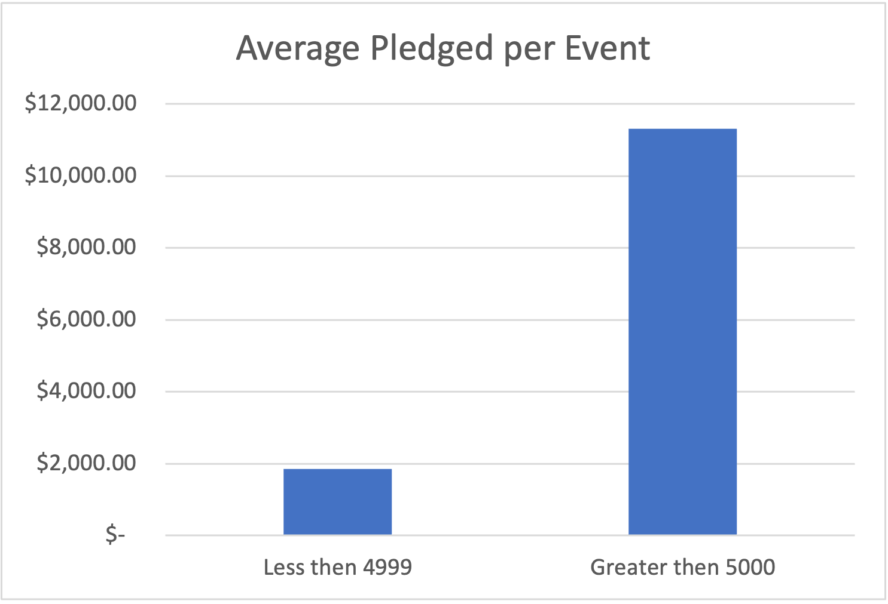

# Kickstarting with Excel

## Overview of Project

### Purpose
The purpose of this analysis is to help Louise to have a better understanding of campaign's types to decide which one is more profitable, and if there is a better time to execute them.

## Analysis and Challenges
Our first challenge was really a challenge. I have no previous experience with Excel, Visual Studio Code, or Git. Following procedures step by step helped me understanding the project little by little to be able to help Louise with her questions.

### Analysis of Outcomes Based on Launch Date

### Analysis of Outcomes Based on Goals

### Challenges and Difficulties Encountered

## Results

### What are two conclusions you can draw about the Outcomes based on Launch Date?
The Theater Outcomes by Launch Date would be more representative if the Y axis showed the percentage of the successful outcomes, in other words, the successful rate, instead of the absolute number of successes. When plotting using the successful outcomes percentage versus the months it shows there is no significant changes throughout the year, and the Line Chart is a good choice.

### What can you conclude about the Outcomes based on Goals?
One line just mirrors the other, as one means success and the other means failure. In addition, using a line to connect the dots creates the wrong impression that it is a measure across time. A Column Graph is better to compare rates among groups. Finally, it is better that the y axis goes up to 100% to prevent the illusion of overestimating value. Another important thing is to dichotomize the groups into two groups: Less than 4999, and greater or equal than 5000. Doing this the sample size of the second group will be larger and more precise is its estimation. The question is: if the greater the goal, the greater the return?

### What are some limitations of this dataset?
One of the limitations is that the dataset only shows the goal and the pledge, but not the amount spent on the campaigns. Missing cost prevents the ability to make any economical evaluation. And another missing data would be the level of complexity for different campaign goals.

### What are some other possible tables and/or graphs that we could create?
A better table and/or graph that we could create is one that shows the final outcome to be the average pledged for each successful campaign. It would show a number of $1,847.43 average per campaign that has less than 4.999 goal versus a number of $11,321.00 average per campaign that has greater or equal than 5000 goal. Which means that considering an equal cost of campaings, we don't have that number, it is better that Louise engage in campaigns with goals greater than 5000: she will get more money with less campaigns. $1,868,049.00 was pledged for 165 successful campaigns greater or equal than 5000 versus $977,292.00 for 529 successful campaigns less than 4999. 

